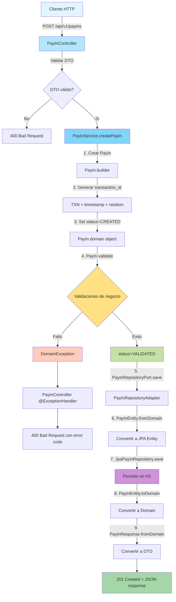
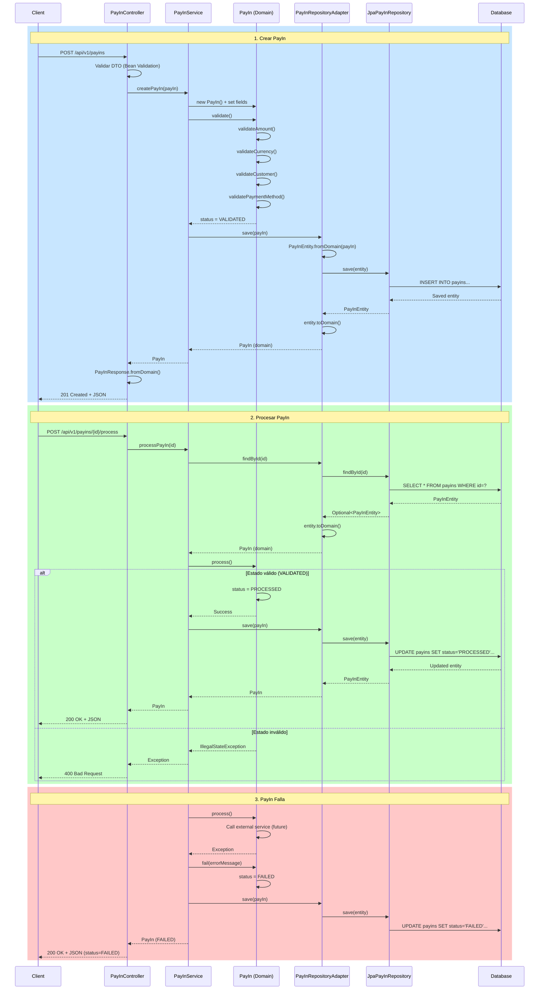

# Diagramas de Arquitectura - PayIn Service

## 1. Arquitectura Hexagonal (High-Level)

```
┌─────────────────────────────────────────────────────────────────┐
│                        ADAPTADORES DE ENTRADA                   │
│  ┌──────────────┐  ┌──────────────┐  ┌──────────────┐         │
│  │ REST API     │  │ GraphQL      │  │ Message      │         │
│  │ Controller   │  │ (future)     │  │ Queue        │         │
│  │              │  │              │  │ (future)     │         │
│  └──────┬───────┘  └──────┬───────┘  └──────┬───────┘         │
│         │                 │                 │                  │
└─────────┼─────────────────┼─────────────────┼──────────────────┘
          │                 │                 │
          v                 v                 v
┌─────────────────────────────────────────────────────────────────┐
│                     PUERTOS DE ENTRADA                          │
│  ┌──────────────────────────────────────────────────────────┐  │
│  │              PayInUseCase (interface)                    │  │
│  │  - createPayIn(PayIn): PayIn                            │  │
│  │  - processPayIn(UUID): PayIn                            │  │
│  │  - getPayIn(UUID): PayIn                                │  │
│  │  - getPayInByTransactionId(String): PayIn              │  │
│  └──────────────────────────────────────────────────────────┘  │
└─────────────────────────────┬───────────────────────────────────┘
                              │
                              v
┌─────────────────────────────────────────────────────────────────┐
│                       NÚCLEO DE DOMINIO                         │
│  ┌────────────────────────────────────────────────────────┐    │
│  │               PayInService (implementa PayInUseCase)   │    │
│  │  - Orquesta lógica de negocio                         │    │
│  │  - Coordina dominio y persistencia                    │    │
│  │  - Gestiona transacciones                             │    │
│  └──────────────────┬─────────────────────────────────────┘    │
│                     │                                           │
│  ┌──────────────────v─────────────────────────────────────┐    │
│  │           PayIn (Aggregate Root)                       │    │
│  │  - id, transactionId, amount, currency, status        │    │
│  │  - validate(): void                                   │    │
│  │  - process(): void                                    │    │
│  │  - fail(String): void                                 │    │
│  └────────────────────────────────────────────────────────┘    │
│                                                                 │
│  ┌─────────────────────────────────────────────────────────┐   │
│  │         DomainException (excepciones de negocio)       │   │
│  │  - errorCode (PAYIN-001, PAYIN-002, etc.)             │   │
│  └─────────────────────────────────────────────────────────┘   │
└─────────────────────────────┬───────────────────────────────────┘
                              │
                              v
┌─────────────────────────────────────────────────────────────────┐
│                     PUERTOS DE SALIDA                           │
│  ┌──────────────────────────────────────────────────────────┐  │
│  │         PayInRepositoryPort (interface)                  │  │
│  │  - save(PayIn): PayIn                                   │  │
│  │  - findById(UUID): Optional<PayIn>                      │  │
│  │  - findByTransactionId(String): Optional<PayIn>        │  │
│  └──────────────────────────────────────────────────────────┘  │
└─────────────────────────────┬───────────────────────────────────┘
                              │
                              v
┌─────────────────────────────────────────────────────────────────┐
│                    ADAPTADORES DE SALIDA                        │
│  ┌──────────────┐  ┌──────────────┐  ┌──────────────┐         │
│  │ JPA/H2       │  │ Payment      │  │ Event        │         │
│  │ Repository   │  │ Gateway      │  │ Publisher    │         │
│  │ Adapter      │  │ (future)     │  │ (future)     │         │
│  └──────┬───────┘  └──────────────┘  └──────────────┘         │
│         │                                                       │
└─────────┼───────────────────────────────────────────────────────┘
          │
          v
    ┌──────────┐
    │ Database │
    │ (H2/PG)  │
    └──────────┘
```

---

## 2. Flujo de Procesamiento de PayIn



---

## 3. Diagrama de Secuencia: Crear y Procesar PayIn



---

## 4. Diagrama de Componentes

```
┌─────────────────────────────────────────────────────────────────────┐
│                           PayIn Service                             │
├─────────────────────────────────────────────────────────────────────┤
│                                                                     │
│  ┌───────────────────────────────────────────────────────────────┐ │
│  │              Interfaces Layer (com.payin.interfaces)          │ │
│  │  ┌──────────────┐  ┌─────────────────────────────────────┐   │ │
│  │  │ PayIn        │  │ DTOs                                │   │ │
│  │  │ Controller   │──┤ - CreatePayInRequest                │   │ │
│  │  │              │  │ - PayInResponse                     │   │ │
│  │  │ @RestController  │ - Error responses                  │   │ │
│  │  └──────┬───────┘  └─────────────────────────────────────┘   │ │
│  │         │                                                     │ │
│  └─────────┼─────────────────────────────────────────────────────┘ │
│            │                                                       │
│            │ depends on                                            │
│            v                                                       │
│  ┌─────────────────────────────────────────────────────────────┐  │
│  │              Domain Layer (com.payin.domain)                │  │
│  │                                                             │  │
│  │  ┌─────────────────────────────────────────────────────┐   │  │
│  │  │ Ports (Interfaces)                                  │   │  │
│  │  │  ┌───────────────┐    ┌────────────────────────┐   │   │  │
│  │  │  │ Input Ports   │    │ Output Ports           │   │   │  │
│  │  │  │ PayInUseCase  │    │ PayInRepositoryPort    │   │   │  │
│  │  │  └───────┬───────┘    └────────────┬───────────┘   │   │  │
│  │  └──────────┼────────────────────────┼───────────────┘   │  │
│  │             │                        │                   │  │
│  │             │ implemented by         │ used by           │  │
│  │             v                        │                   │  │
│  │  ┌──────────────────────────────────┼────────────────┐  │  │
│  │  │ Services                         │                │  │  │
│  │  │ PayInService ────────────────────┘                │  │  │
│  │  │ @Service                                          │  │  │
│  │  │ @Transactional                                    │  │  │
│  │  └──────────────────────┬────────────────────────────┘  │  │
│  │                         │                               │  │
│  │                         │ uses                          │  │
│  │                         v                               │  │
│  │  ┌─────────────────────────────────────────────────┐   │  │
│  │  │ Domain Models                                   │   │  │
│  │  │ ┌─────────────┐  ┌─────────────┐              │   │  │
│  │  │ │ PayIn       │  │ Customer    │              │   │  │
│  │  │ │ (Aggregate) │  │ Account     │              │   │  │
│  │  │ │             │  │ PaymentMethod              │   │  │
│  │  │ │ - validate()│  │ PaymentProvider             │   │  │
│  │  │ │ - process() │  │                             │   │  │
│  │  │ │ - fail()    │  │                             │   │  │
│  │  │ └─────────────┘  └─────────────┘              │   │  │
│  │  └─────────────────────────────────────────────────┘   │  │
│  │                                                         │  │
│  │  ┌─────────────────────────────────────────────────┐   │  │
│  │  │ Domain Exceptions                               │   │  │
│  │  │ DomainException (errorCode + message)          │   │  │
│  │  └─────────────────────────────────────────────────┘   │  │
│  └─────────────────────────────────────────────────────────┘  │
│                         │                                     │
│                         │ depends on                          │
│                         v                                     │
│  ┌─────────────────────────────────────────────────────────┐  │
│  │       Infrastructure Layer (com.payin.infrastructure)   │  │
│  │                                                         │  │
│  │  ┌──────────────────────────────────────────────────┐  │  │
│  │  │ Adapters (implements output ports)              │  │  │
│  │  │ ┌────────────────────────────────────────────┐  │  │  │
│  │  │ │ PayInRepositoryAdapter                     │  │  │  │
│  │  │ │ implements PayInRepositoryPort             │  │  │  │
│  │  │ │ @Component                                 │  │  │  │
│  │  │ └────────────┬───────────────────────────────┘  │  │  │
│  │  └──────────────┼──────────────────────────────────┘  │  │
│  │                 │                                     │  │
│  │                 │ uses                                │  │
│  │                 v                                     │  │
│  │  ┌──────────────────────────────────────────────────┐  │  │
│  │  │ JPA Repositories                                 │  │  │
│  │  │ JpaPayInRepository extends JpaRepository         │  │  │
│  │  │ @Repository                                      │  │  │
│  │  └────────────┬─────────────────────────────────────┘  │  │
│  │               │                                        │  │
│  │               │ manages                                │  │
│  │               v                                        │  │
│  │  ┌──────────────────────────────────────────────────┐  │  │
│  │  │ JPA Entities                                     │  │  │
│  │  │ ┌────────────────────────────────────────────┐  │  │  │
│  │  │ │ PayInEntity                                │  │  │  │
│  │  │ │ @Entity @Table(name="payins")             │  │  │  │
│  │  │ │                                            │  │  │  │
│  │  │ │ + fromDomain(PayIn): PayInEntity          │  │  │  │
│  │  │ │ + toDomain(): PayIn                       │  │  │  │
│  │  │ └────────────────────────────────────────────┘  │  │  │
│  │  └──────────────────────────────────────────────────┘  │  │
│  └─────────────────────────────────────────────────────────┘  │
│                         │                                     │
│                         │ persists to                         │
│                         v                                     │
│                  ┌─────────────┐                              │
│                  │   Database  │                              │
│                  │   H2/PG     │                              │
│                  └─────────────┘                              │
└─────────────────────────────────────────────────────────────────┘

External Dependencies:
┌──────────────┐    ┌──────────────┐    ┌──────────────┐
│ Spring Boot  │    │   Lombok     │    │  MapStruct   │
└──────────────┘    └──────────────┘    └──────────────┘
```

---

## 5. Diagrama de Estados del PayIn

```
                    ┌─────────────────┐
                    │    CREATED      │
                    │  (Estado inicial│
                    │   al crear)     │
                    └────────┬────────┘
                             │
                             │ validate()
                             │ - validateAmount()
                             │ - validateCurrency()
                             │ - validateCustomer()
                             │ - validatePaymentMethod()
                             │
                             v
                    ┌─────────────────┐
                    │   VALIDATED     │
                    │ (Listo para     │
                    │  procesar)      │
                    └────────┬────────┘
                             │
                             │ process()
                ┌────────────┼────────────┐
                │                         │
                │ Success                 │ Failure
                │                         │
                v                         v
    ┌─────────────────┐        ┌─────────────────┐
    │   PROCESSED     │        │     FAILED      │
    │ (Transacción    │        │ (Transacción    │
    │  completada)    │        │  fallida)       │
    └─────────────────┘        └─────────────────┘
                                        │
                                        │ Contiene
                                        │ errorMessage
                                        v
                              ┌──────────────────────┐
                              │ "Insufficient funds" │
                              │ "Gateway timeout"    │
                              │ "Invalid card"       │
                              └──────────────────────┘

Invariantes:
- Solo se puede llamar process() si status == VALIDATED
- Una vez PROCESSED o FAILED, el estado es final (no hay transiciones)
- Cada transición actualiza updatedAt timestamp
- fail() puede ser llamado desde cualquier estado

Validaciones por Estado:
┌──────────┬────────────────────────────────────────────┐
│ CREATED  │ - ID generado (UUID)                      │
│          │ - transactionId generado                  │
│          │ - createdAt = now()                       │
└──────────┴────────────────────────────────────────────┘
┌──────────┬────────────────────────────────────────────┐
│VALIDATED │ - amount > 0 AND <= 1,000,000             │
│          │ - currency es código ISO 3 letras         │
│          │ - customerId no vacío                     │
│          │ - paymentMethodId no vacío                │
└──────────┴────────────────────────────────────────────┘
┌──────────┬────────────────────────────────────────────┐
│PROCESSED │ - Payment gateway confirmó                │
│          │ - Fondos debitados                        │
│          │ - updatedAt actualizado                   │
└──────────┴────────────────────────────────────────────┘
┌──────────┬────────────────────────────────────────────┐
│ FAILED   │ - errorMessage poblado                    │
│          │ - updatedAt actualizado                   │
│          │ - Gateway rechazó o timeout               │
└──────────┴────────────────────────────────────────────┘
```

---

## 6. Diagrama de Despliegue

```
┌─────────────────────────────────────────────────────────────────┐
│                         AWS / GCP / Azure                       │
├─────────────────────────────────────────────────────────────────┤
│                                                                 │
│  ┌───────────────────────────────────────────────────────────┐ │
│  │                   API Gateway / Load Balancer             │ │
│  │  - Rate limiting                                          │ │
│  │  - SSL termination                                        │ │
│  │  - Request routing                                        │ │
│  └──────────────────────────┬────────────────────────────────┘ │
│                             │                                  │
│                             v                                  │
│  ┌───────────────────────────────────────────────────────────┐ │
│  │              Kubernetes Cluster (EKS/GKE/AKS)             │ │
│  │                                                           │ │
│  │  ┌────────────┐  ┌────────────┐  ┌────────────┐        │ │
│  │  │ PayIn Pod 1│  │ PayIn Pod 2│  │ PayIn Pod N│        │ │
│  │  │            │  │            │  │            │        │ │
│  │  │ Java 17    │  │ Java 17    │  │ Java 17    │        │ │
│  │  │ Spring Boot│  │ Spring Boot│  │ Spring Boot│        │ │
│  │  │ Port: 8080 │  │ Port: 8080 │  │ Port: 8080 │        │ │
│  │  └─────┬──────┘  └─────┬──────┘  └─────┬──────┘        │ │
│  │        │               │               │                │ │
│  │        └───────────────┴───────────────┘                │ │
│  │                        │                                │ │
│  │                        v                                │ │
│  │        ┌───────────────────────────────┐               │ │
│  │        │    Service (ClusterIP)        │               │ │
│  │        └───────────────┬───────────────┘               │ │
│  └────────────────────────┼───────────────────────────────┘ │
│                           │                                  │
│       ┌───────────────────┴───────────────────┐             │
│       │                                       │             │
│       v                                       v             │
│  ┌─────────────────┐              ┌─────────────────┐      │
│  │   PostgreSQL    │              │  Redis Cache    │      │
│  │   (RDS/Cloud    │              │  (ElastiCache)  │      │
│  │    SQL)         │              │                 │      │
│  │  - Primary      │              │ - TTL: 5 min    │      │
│  │  - Replica(s)   │              │ - Max memory:   │      │
│  │  - Auto-backup  │              │   2GB           │      │
│  └─────────────────┘              └─────────────────┘      │
│                                                             │
│  ┌─────────────────────────────────────────────────────┐   │
│  │           Observability Stack                       │   │
│  │  ┌──────────────┐  ┌──────────────┐  ┌──────────┐ │   │
│  │  │ Prometheus   │  │  Grafana     │  │  ELK     │ │   │
│  │  │ (Metrics)    │  │ (Dashboards) │  │ (Logs)   │ │   │
│  │  └──────────────┘  └──────────────┘  └──────────┘ │   │
│  └─────────────────────────────────────────────────────┘   │
│                                                             │
└─────────────────────────────────────────────────────────────┘

External Services:
┌──────────────┐    ┌──────────────┐    ┌──────────────┐
│   Stripe     │    │   PayPal     │    │ Notification │
│   Gateway    │    │   Gateway    │    │   Service    │
└──────────────┘    └──────────────┘    └──────────────┘

Resource Specifications:
- PayIn Pods: 2 CPU, 4GB RAM, 3 replicas
- PostgreSQL: db.t3.medium (2 vCPU, 4GB RAM)
- Redis: cache.t3.micro (2 vCPU, 1GB RAM)
- Auto-scaling: Min 3, Max 10 pods (CPU > 70%)
```

---

## 7. Mapa de Dependencias

```
┌─────────────────────────────────────────────────────────────┐
│                      PayIn Service                          │
│                                                             │
│  Dependencies:                                              │
│                                                             │
│  ┌─────────────────────────────────────────────────────┐   │
│  │ Spring Boot Ecosystem                               │   │
│  │ ┌─────────────────┐  ┌────────────────────────┐    │   │
│  │ │ spring-boot-    │  │ spring-boot-starter-   │    │   │
│  │ │ starter-web     │  │ data-jpa               │    │   │
│  │ │ (Tomcat, REST)  │  │ (Hibernate, JPA)       │    │   │
│  │ └─────────────────┘  └────────────────────────┘    │   │
│  │ ┌─────────────────┐  ┌────────────────────────┐    │   │
│  │ │ spring-boot-    │  │ springdoc-openapi-     │    │   │
│  │ │ starter-        │  │ starter-webmvc-ui      │    │   │
│  │ │ validation      │  │ (Swagger docs)         │    │   │
│  │ └─────────────────┘  └────────────────────────┘    │   │
│  └─────────────────────────────────────────────────────┘   │
│                                                             │
│  ┌─────────────────────────────────────────────────────┐   │
│  │ Database                                            │   │
│  │ ┌─────────────────┐  ┌────────────────────────┐    │   │
│  │ │ H2 Database     │  │ PostgreSQL Driver      │    │   │
│  │ │ (Development)   │  │ (Production)           │    │   │
│  │ └─────────────────┘  └────────────────────────┘    │   │
│  └─────────────────────────────────────────────────────┘   │
│                                                             │
│  ┌─────────────────────────────────────────────────────┐   │
│  │ Code Generation                                     │   │
│  │ ┌─────────────────┐  ┌────────────────────────┐    │   │
│  │ │ Lombok          │  │ MapStruct              │    │   │
│  │ │ (Boilerplate)   │  │ (Object mapping)       │    │   │
│  │ └─────────────────┘  └────────────────────────┘    │   │
│  └─────────────────────────────────────────────────────┘   │
│                                                             │
│  ┌─────────────────────────────────────────────────────┐   │
│  │ Testing (future)                                    │   │
│  │ ┌─────────────────┐  ┌────────────────────────┐    │   │
│  │ │ JUnit 5         │  │ Mockito                │    │   │
│  │ └─────────────────┘  └────────────────────────┘    │   │
│  │ ┌─────────────────┐  ┌────────────────────────┐    │   │
│  │ │ TestContainers  │  │ REST Assured           │    │   │
│  │ └─────────────────┘  └────────────────────────┘    │   │
│  └─────────────────────────────────────────────────────┘   │
└─────────────────────────────────────────────────────────────┘

Dependency Version Management:
- Spring Boot BOM: 3.2.0
- Java Version: 17
- Maven: 3.8+
```

---

## Leyenda de Notación

- **Rectángulos**: Componentes o módulos
- **Flechas sólidas**: Dependencias (depends on)
- **Flechas punteadas**: Interfaces/contratos
- **Diamantes**: Composición
- **Círculos**: Puertos (interfaces)
- **Color azul**: Capa de interfaces
- **Color verde**: Capa de dominio
- **Color morado**: Capa de infraestructura
